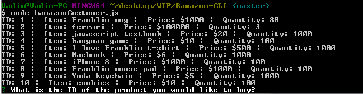
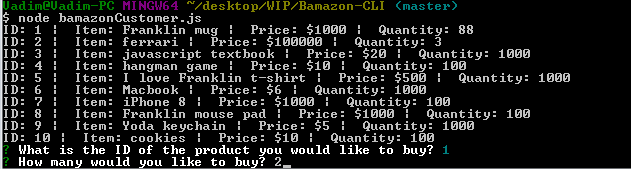
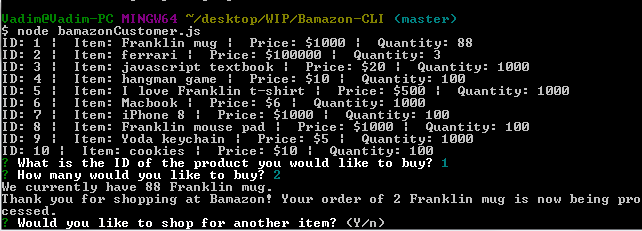
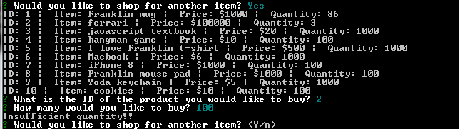
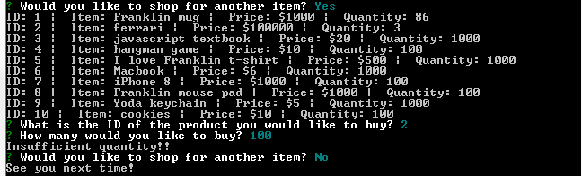

# Bamazon-CLI
The Bamazon app is a marketplace-like console application.  The entry point is bamazonCustomer.js

initially, the app will list all the items for sale and prompt the user to select a product ID:

Once an item is selected, the customer will select a quantity:

The Bamazon app will check stock and either fill the order:

or display a message there there is insufficient quantity:

If the customer selects "N" when they are prompted if they would like to shop for another item then the app exists with a "See you next time" message

